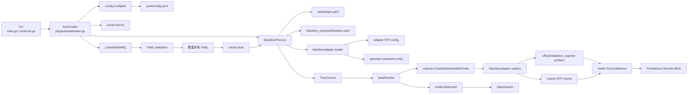
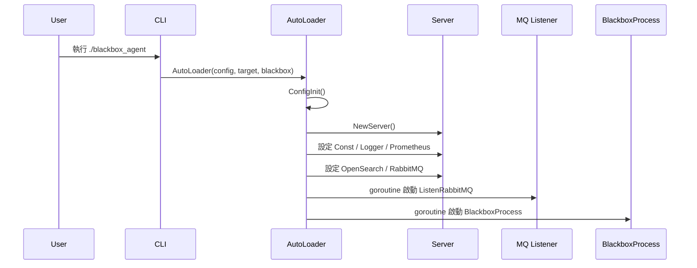
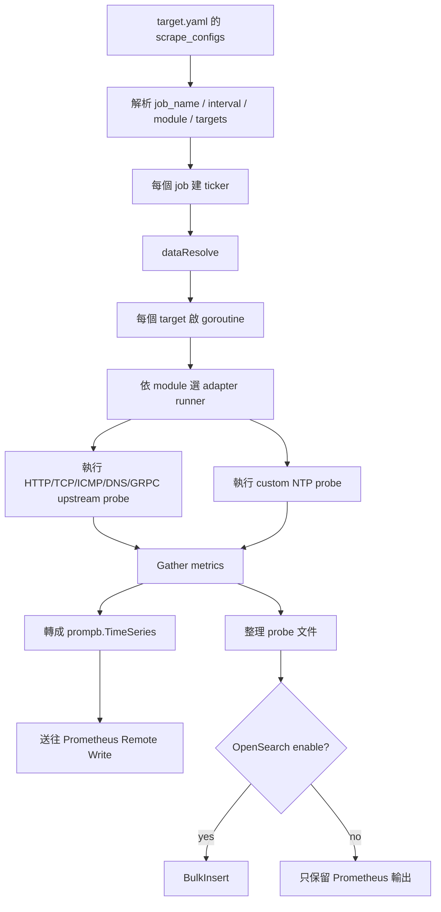
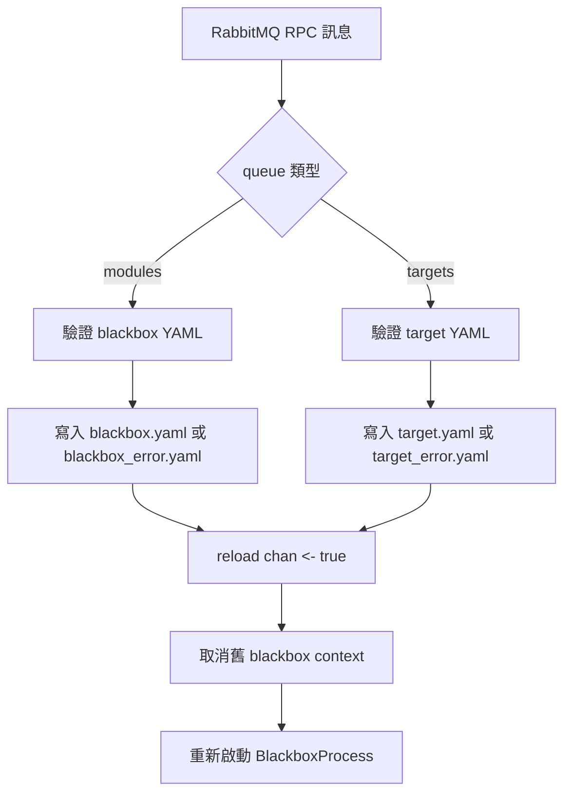

# 架構圖與資料流

本文件是偏維運與交接視角的架構圖版本，重點是快速理解元件關係、資料流與 reload 路徑。

## 整體架構圖

## 啟動流程圖

## Probe 執行資料流

## RabbitMQ Reload 流程圖

## 元件說明

### CLI 層

- `main.go`
- `cmd/root.go`

用途：

- 接收參數
- 指定 config / target / blackbox 檔名
- 交給 AutoLoader 啟動

### 啟動與共享狀態層

- `pkg/autoload/loader.go`
- `server/server.go`
- `pkg/tool/log.go`
- `pkg/tool/gs.go`

用途：

- 初始化全域依賴
- 保存共享連線與常數
- 管理 graceful shutdown
- 管理 reload

### Probe 執行層

- `handler/blackbox.go`
- `exporter/config.go`
- `exporter/handler.go`
- `internal/blackboxadapter/*`

用途：

- 排程 job
- 平行執行 target probe
- 收集 probe 結果與 metrics
- 分流官方 blackbox config 與自定義 `ntp` config

### YAML 資產層

- `blackbox_exporter/blackbox.yaml`
- `blackbox_exporter/blackbox_example.yaml`
- `blackbox_exporter/blackbox_error.yaml`

用途：

- 保留本地 module 設定檔與樣板
- 提供 reload 與錯誤落盤使用
- 不再承載 blackbox runtime source code

### 設定更新層

- `handler/mq.go`
- `handler/yaml_check/module/*`
- `handler/yaml_check/target/*`

用途：

- 接收新 YAML
- 驗證格式與內容
- 寫回本地檔案
- 觸發重載

### 輸出層

- `model/metric/metric.go`
- `model/prometheusremotewrite/remotewriteclient.go`
- `model/opensearch.go`

用途：

- 轉換 metrics
- 發送 remote write
- 寫入 OpenSearch

## 目前架構上的注意點

- reload 後固定使用 `target.yaml` 與 `blackbox.yaml` 重啟，未保留原本 CLI 自訂檔名
- `http_server/` 目前未接入主啟動流程
- metrics 處理時會產生 `output.txt`
- `server.Server` 是全域共享狀態，修改時要注意併發與 reload 影響
- `blackbox.yaml` 雖然是單一檔案，但 `ntp` 區塊不會直接交給官方 blackbox_exporter config parser，而是先由 adapter 抽出並分流
